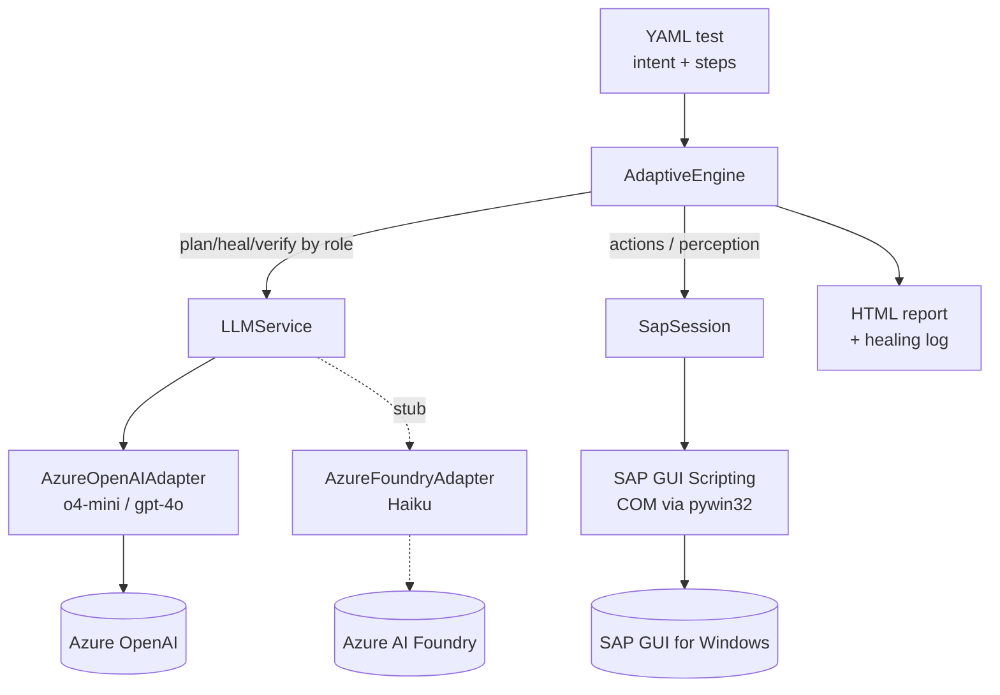

# AI-Guided Desktop Test Automation — Design

**Project:** AI_DesktopTest Automation
**Target:** SAP GUI for Windows · Azure-hosted models · Adaptive architecture
**Status:** v0.1 — scaffold + working engine (o4-mini), Haiku adapter stubbed

---

## 1. Vision

An RPA-style bot for **desktop** applications, driven by AI. Instead of brittle
recorded coordinates, an LLM turns a natural-language test intent into concrete
actions, adapts when the UI changes, and judges outcomes in plain language. The
first target is **SAP GUI**, because its built-in Scripting API makes it one of
the most automatable desktop apps in existence.

## 2. Core loop

Four capabilities in a loop: **perceive** the screen → **decide** the next action
→ **act** on the UI → **verify** the result.

```
NL intent ─► Plan (once) ─► Execute deterministically ─► Verify ─► Report
                                   │
                                 step fails
                                   ▼
                            Self-heal (AI) ─► retry ─► rewrite cached step
```

## 3. Architecture choice — Adaptive

Of three reference designs (Pragmatic / Adaptive / Fully-agentic), this project
implements **Adaptive**:

- **Deterministic-first execution.** A cached plan runs with **no AI in the loop**
  on the happy path — fast, cheap, repeatable.
- **AI where it pays off.** The model is invoked only to (a) plan a test once,
  (b) self-heal a failed step, (c) verify the business outcome.
- **Self-healing.** When an element id has moved (new release/transport, popup),
  the healer inspects the live SAP tree, remaps the id, retries, and rewrites the
  cached step so the next run is deterministic again.

This gives RPA-grade reliability on the happy path with AI robustness under drift.

## 4. Why SAP GUI for Windows

SAP GUI ships a **Scripting API** exposing every element with a stable id, e.g.
`wnd[0]/usr/ctxtVBAK-AUART` (order-type field), `wnd[0]/tbar[0]/okcd` (command
box). The bot reads/sets values directly — no coordinates, no vision guessing.

**Cross-platform note.** "Cross-platform" + "SAP GUI" interact: full Scripting is
**SAP GUI for Windows** only. The chosen topology runs the **execution node on
Windows**, while authoring/triggering/reporting can happen from any OS (CI, web).
Off-Windows, the SAP layer runs in **dry-run** mode for development.

## 5. Components

| Layer | Module | Responsibility |
|---|---|---|
| Perceive + Act | `sap/session.py` | SAP GUI Scripting via pywin32 COM: attach, find/set/read, send keys, snapshot tree, hardcopy screenshot. Dry-run off-Windows. |
| Decide | `engine/ai.py` | Planner, self-healer, verifier — each calls the model by **role**. |
| Orchestrate | `engine/engine.py` | The Adaptive loop: plan → execute → heal → verify. |
| Contract | `engine/schema.py` | `TestCase`, `Step`, `StepResult`, `RunResult`. |
| Model layer | `model/*` | Provider-agnostic `LLMService` (Azure o4-mini working, Haiku stub). |
| Authoring | `tests/*.yaml`, `engine/loader.py` | NL-intent or explicit-step YAML tests. |
| Run / report | `run.py`, `engine/report.py` | CLI runner → HTML report with step trace + healing log. |

### Component diagram



## 6. Model layer (Azure: o4-mini now, Haiku later)

Generalised from the existing Playwright studio's two-client router. That router
branched on **deployment** (main vs reasoning); this one branches on **provider**,
behind one `LLMService` interface (`ask` / `vision`):

- **`AzureOpenAIAdapter` (working)** — o4-mini and gpt-4o via the `openai` SDK's
  `AzureOpenAI` client. Handles reasoning-model quirks: omits `temperature`, uses
  `max_completion_tokens`.
- **`AzureFoundryAdapter` (stub)** — Haiku is served through **Azure AI Foundry**,
  which the `openai` SDK **cannot** call. The stub documents two fill-ins: the
  **Azure AI Inference SDK** or **LiteLLM**. Enabling Haiku is: implement two
  methods + set `AZURE_FOUNDRY_*` env vars + point a role at `haiku`. No other
  code changes.

Routing is config-driven (`config/models.yaml`):

```yaml
roles:   {planner: reasoning, verifier: general, self_heal: reasoning, fallback: general}
```

Transient errors (429/5xx) retry with backoff; a hard primary failure falls back
to the `fallback` role.

## 7. Authoring model

Two styles, both valid in one YAML file:

1. **Intent-only** — give `intent` + `expect`; the planner generates steps on the
   first run. Cache them back for deterministic reruns.
2. **Explicit steps** — provide `steps` for a fast happy path; the engine still
   self-heals any step whose element id has moved.

## 8. Verification

The verifier reads the SAP **status bar** (S/E/W message) and final screen tree,
then judges pass/fail against the NL `expect` and captures business values
(document numbers, totals). A fast deterministic `assert_status` step is also
available for the happy path.

## 9. Prerequisites (Windows execution node)

- Server profile: `sapgui/user_scripting = TRUE`.
- Client: SAP GUI Options → Accessibility & Scripting → Scripting enabled;
  disable attach/connect warning popups for unattended runs.
- Logged into SAP Logon before a run.
- `pip install -r requirements.txt` (includes `pywin32`).

## 10. Phased build plan

1. **Thin vertical slice (done).** SAP Scripting wrapper + model layer + Adaptive
   engine + offline tests. Runs end-to-end in dry-run.
2. **Live SAP connect.** Run on a Windows node against a sandbox client; calibrate
   element ids for your transactions (record or planner-infer).
3. **Self-heal hardening.** Exercise screen drift; tune heal prompts; persist
   rewritten plans (a `selector_memory.json`-style cache, as in the Playwright studio).
4. **Haiku enablement.** Implement the Foundry adapter; A/B o4-mini vs Haiku per role.
5. **CI + scheduling.** Wire `run.py`/pytest into CI on the Windows runner;
   publish HTML reports; add credential handling via a vault.

## 11. Risks & mitigations

| Risk | Mitigation |
|---|---|
| Element ids differ across SAP releases/transports | Self-heal + cached remaps; pin a sandbox client per suite |
| Reasoning-model cost/latency (o4-mini reasoning tokens) | Deterministic-first keeps AI out of the happy path; cheap model for verify |
| Windows-only execution | Windows runner node; author/report cross-platform; dry-run for dev |
| Sensitive data in vision screenshots | Gate vision (host/transaction allowlist), as in the studio's `VISION_ALLOWED_HOSTS` |
| Haiku transport differs from OpenAI | Isolated behind `AzureFoundryAdapter`; rest of system unchanged |
